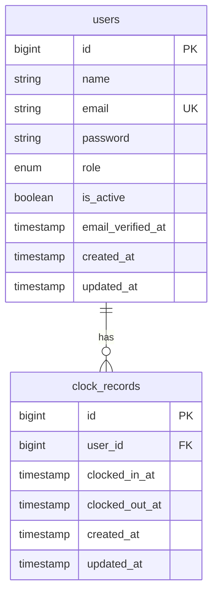

# Data Model — fichaccom

Employee time-tracking application. Laravel 11, MySQL.

---

## Tables

### `users`

Default Laravel `users` table extended with two additional columns.

| Column | Type | Default | Nullable | Notes |
|---|---|---|---|---|
| `id` | bigint PK | — | No | Auto-increment |
| `name` | varchar(255) | — | No | Employee full name |
| `email` | varchar(255) | — | No | Unique |
| `email_verified_at` | timestamp | — | Yes | |
| `password` | varchar(255) | — | No | Bcrypt hash |
| `role` | enum('admin','employee') | `'employee'` | No | Cast to `App\Enums\UserRole` |
| `is_active` | boolean | `true` | No | `false` blocks login |
| `remember_token` | varchar(100) | — | Yes | |
| `created_at` / `updated_at` | timestamps | — | Yes | |

**Indexes**: `email` (unique).

**Cast**: `role` → `App\Enums\UserRole` (`Admin = 'admin'`, `Employee = 'employee'`).

---

### `clock_records`

Stub table for shift tracking. Write logic added in US-002.

| Column | Type | Default | Nullable | Notes |
|---|---|---|---|---|
| `id` | bigint PK | — | No | Auto-increment |
| `user_id` | bigint FK | — | No | → `users.id`, CASCADE DELETE |
| `clocked_in_at` | timestamp | — | No | Shift start |
| `clocked_out_at` | timestamp | — | Yes | `null` = open/active shift |
| `created_at` / `updated_at` | timestamps | — | Yes | |

**Relationships**: `clock_records.user_id` → `users.id` (CASCADE on delete).

**Business rules**:
- An open shift has `clocked_out_at = null`.
- Deleting a user removes all their clock records (CASCADE).
- Employees may only read their own records (`ClockRecordPolicy`).

---

## Entity Relationship Diagram

